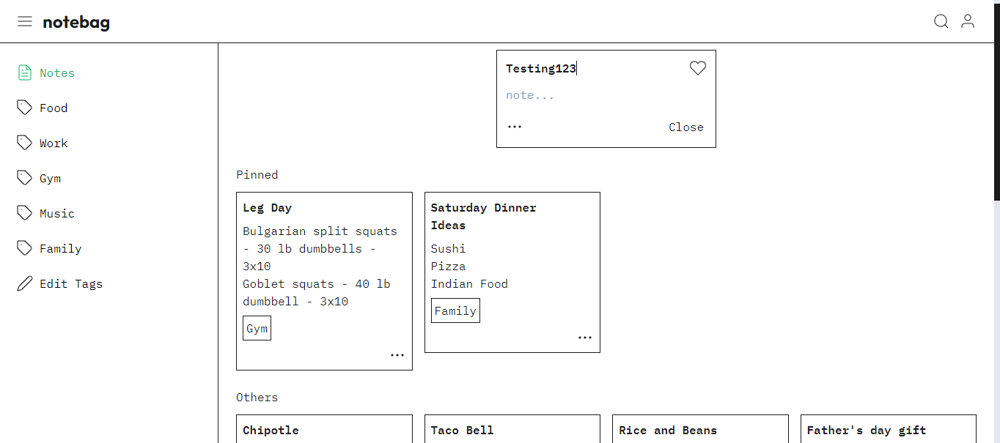

# Notebag

## Table of Contents

- [Overview](#overview)
- [Built With](#built-with)
- [Features](#features)
- [Acknowledgements](#acknowledgements)

## Overview

[Live Demo](https://notebag.site)

This is the server for a notes app heavily influenced by Google Keep. For some
reason notes apps are the web app I use the most, so I've wanted to build my own
since I started coding.

I have built several beginner express servers using MongoDB, buit this is my
first attempt at using MySQL. I still have a lot to learn about relational
databases, but this project helped me get familiar with the SQL language.
This is also my first try at using JWT for authorization instead of sessions.
While the process was difficult, I enjoyed learning a better method for
authorization that I can use on future projects.

For developers attempting a project similar to this, I don't know if it was
ultimately worth it to develop the entire backend myself. I did find the
experience of building a full stack application very rewarding, but finishing
version 1.0 of this app took an eternity. If I didn't catch COVID 19 last week,
I never would have finished this. But back to my point, there's some options
like Firebase that would have gotten me to the finish line faster.

### Built With

- [Node.js](https://nodejs.org/en)
- [TypeScript](https://www.typescriptlang.org/)
- [MySQL](https://www.mysql.com/)

## Features

- User authorization - Users can log in using email and password.
- JWT Tokens - User sessions are tracked using JWT tokens, so logged in users do not
  need to re-enter their email and password until refresh tokens expire.
- Note CRUD - Users can create, read, update and delete notes.
- Tags CRUD - Users can do the same for tags, which can be added to and removed from
  notes.
- Pinned status - Notes can be marked as favorites via a boolean "pinned" status.
  Pinned timestamps are also tracked for sorting purposes.

## Acknowledgements

I am a real noob with the backend guys. I needed help so I went to Youtube. Could not
have finished without the following:

- [This video](https://www.youtube.com/watch?v=Hej48pi_lOc&t=858s) by Sam Meech-Ward explaining
  how to implement MySQL with Express and Node.js.
- [This video](https://www.youtube.com/watch?v=mbsmsi7l3r4) by Kyle Cook explaining how to use
  JWT tokens in Node.js.
